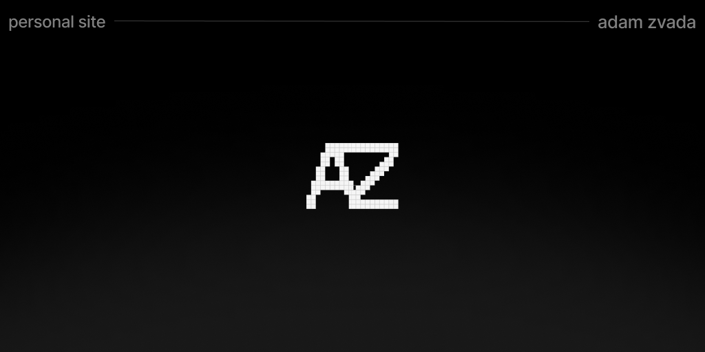

## Adam's Personal Site



Check out the page [here](https://adamzvada.com).

This is a personal site built with 
- [Next.js App Router](https://nextjs.org/)
- [Contentlayer](https://contentlayer.dev/)
- [Tailwind CSS](https://tailwindcss.com/)

Feel free to clone this repository and use it as a starting point for your personal site.

## Getting Started

To get started with this project, you can clone the repository and install the dependencies. You can start the development server using npm, yarn, pnpm, or bun.

```bash
npm install
npm run dev
``````

Open http://localhost:3000 in your browser to see the result. You can start editing the page by modifying `app/page.tsx` and the `/content` directory.